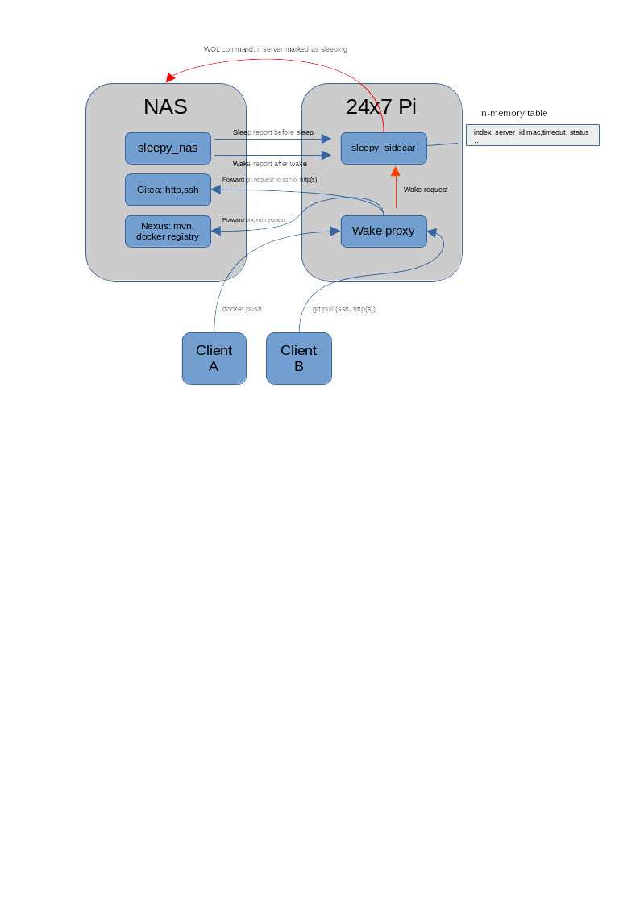

# Smart Wake for Sleepy NAS

## Idea

NAS is sleeping. To get access to "services" located on NAS one need to WOL it via another PC or smartphone app.

So in worst case -- one need to get physical access to server power button. In best -- get little distraction running smartphone app.

But, what if we have a unit on network like Raspberry/Orange/Rock Pi ? We can use it as proxy server to access some services, which NAS provides.

For example, NAS serves Gitea and Nexus (both in Docker containers). One wants to access git on nas. 

* http(s)://24x7pi/git or ssh -p 2222 24x7pi will should give access to Gitea
* http(s)://24x7pi/nexus will give access to Nexus
* docker pul 24x7pi:42000/my_super_image will give a pull of "my_super_image"

Again, all actual servers will be on NAS, but accessed via 24x7pi. At the same time PI should wake-up NAS server and pass request to it.


## Diagram




## Sleepy Sidecar

A small golang-based REST-enabled application. Provides following methods:

* GET /go/server_id -- sends WOL packet to server with id "server_id" and marks it as "awake" in in-memory table. Does not send WOL packet if server is already awake.
* GET /status/get/server_id -- Gets status of server 
* POST /status/sleep/server_id -- Sets status to "sleep" in in-memory table
* POST /status/wake/server_id -- Sets status to "awake" in in-memory table, but does not send any wake server
* GET /alive -- formal method for liveness probe

`server_id` is an alphanumeric id of server in config file. Config file looks like this:

```
server_id,11:7C:45:48:61:BF,10
```

Quite simple -- server identifier, MAC and wake timeout in seconds. Wake timeout should be aligned with real wake time (usually time from packet arrival to network availability) and backoff interval of sleepy_nas script.

## Wake proxy

For my particular case I selected the [OpenResty](https://openresty.org/en/) project. It is "nginx on steroids", which allows to inject some lua code into pre-processing. I was already using nginx as a part of home infrastructure, so transition was quite smooth.

Probably there are more options to consider -- target app should be quite robust and be able to send some http requests to talk to Sleepy Car. 

In my case -- OpenResty is just enough. It can act like http forwarding proxy and stream forwarding proxy.

Streaming proxy is quite simple -- one can "curl" Sleepy Car with a request to wake up and just continue. Module [balancer_by_lua_file] (https://github.com/openresty/lua-nginx-module#balancer_by_lua_file) is used.

HTTP proxy requires some lua coding. Imaging running "curl" on every http request -- this will absolutely kill performance. Module [rewrite_by_lua] (https://github.com/openresty/lua-nginx-module#rewrite_by_lua) and  [lua-resty-http] https://github.com/ledgetech/lua-resty-http are used.

Lua-native HTTP call gives performance very close to realtime running even on one kernel of my RK3399-based 24x7 home server. Highly likely, even cheap Orange Pi Zero will do. Not sure about original dusty Raspberry Pi.

## Putting it all together

### Sleepy sidecar

#### Manual build

You will need golang installed and configured.

In sleepy_sidecar/src: 

```
go mod init znoxx.me/sidecar
go get github.com/znoxx/gowol
go build -o ./sidecar
```

Then, create a config file as described above with your server_id(s), MAC(s) and timeouts.

To run:
```
./sidecar -address address_to_listen -port listen_port -config your_config
```

#### Via docker-compose or docker

IMPORTANT: Host network must be used. In other case -- your WOL packet will never leave some internal docker network.

See sleepy_sidecar folder for docker-compose.yaml examples or build.sh to build image separately.

#### Testing 

Try to run: `curl http://address:port/go/server_id`. Address, port are configured like above, server_id is set in your config file.

On first call, WOL packet will be sent to appropriate MAC address and small pause will be done. On second call -- request will be processed almost immediately (since server is marked as "awake").

After this step you are ready to deploy sleepy_sidecar on desired 24x7 box.

### Sleepy NAS integration

To enabling Sleepy NAS reporting to Sleepy Sidecar, add following section in Sleepy NAS ini.

```
[sidecar]
sidecar_address=http://24x7pi:port
sidecar_server_id=server
```

After this Sleepy NAS will report status to Sleepy Sidecar right before sleep command and immediately after wake and backoff timeout.


### Wake proxy 

One will need to build docker image here anyway, since 'curl' binary is injected inside.

IMPORTANT: Before building, one must grab submodules involved in project.

```
git submodule init
git submodule update
```
This will grab "lua-resty-http" module from github.

After this -- just run `docker build . -t wake_proxy` or build via docker-compose. But well, before running docker-compose you will need to get familiar with config.

#### Configuration and volumes

##### Volumes

* One should provide volume, pointing to lua-resty-http inside container. This is done to avoid using "fat" image of openresty. 

```
${PWD}/lua-resty-http/lib:/usr/local/openresty/site/lualib
```
* Another volume is for lua-helpers, located in folder "lua"

```
${PWD}/lua:/lua:ro
```

* openresty nginx config should be also substituted

```
${PWD}/conf/nginx.conf:/usr/local/openresty/nginx/conf/nginx.conf:ro
```

* html folder is not mandatory, however good for testing 

```
* ${PWD}/html:/usr/share/nginx/html:ro
```

##### Lua handlers

Folder lua contains two handlers:

* server.lua
* server_curl.lua

First one is used to process forward http proxy requests. Second one is to process streaming proxy requests.

You will need to edit them, but it's quite easy if you are familiar with _any_ programming language. 

Just change sleepy_car location  and timeout values (ms in server.lua and seconds in server_curl.lua).

##### Nginx/openresty config

Provided config is generic and provides example for 

* Reverse proxy for HTTP(s) to git
* Streaming proxy for ssh access from port 2222 to port 2222

Change it to your needs.

## FAQ

### Why so complicated ?

Not really. Just get an idea, how it works, and things will be much more clear. However, if you have better solution -- feel free to open pull request.

### Can I setup ssh access with port 22 ?

Yes, one can move sshd on 24x7pi host to some other port. And stream-proxify port 22 to desired server

### Can I access SAMBA in same way ?

Probably. You need to stream-proxify SAMBA-related ports and access 24x7pi host instead of NAS. Requests will be translated.

### What about NFS ?

As far as I know, UDP is involved here. Since no UDP proxy in openresty, there is no pre-made solution. One should try to find something with UDP support ?

### How to calculate timeouts ?

Oops. Trial and error.

### What about https ?

Why not ? Just setup https in openresty same way it is done in nginx.


